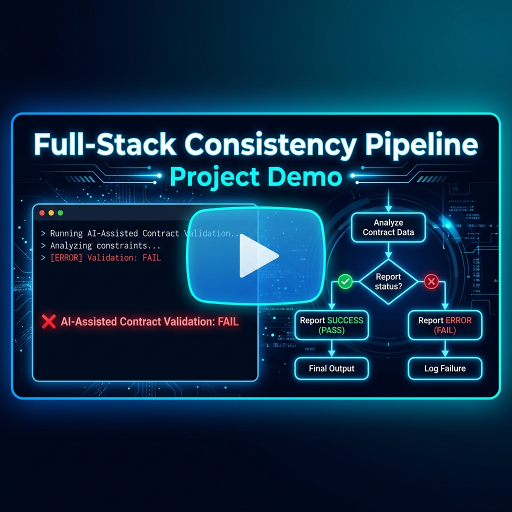

# 🚀 Full-Stack Consistency Pipeline

[](https://graphql.org/)
[](https://nextjs.org/)
[](https://www.typescriptlang.org/)
[](https://ollama.com/)

A modern monorepo illustrating a **Full-Stack GraphQL Consistency Pipeline**. 

Unlike conventional pipelines that only check for static syntax compliance (e.g. types and schema generation), this project implements a hybrid approach combining **strict static compilation checks** and **AI-assisted semantic contract validation**. It detects runtime-only logic drift (such as unit mismatches, decimal scaling errors, and business rule modifications) before code is merged.

---

## 🎥 Video Demonstration

Below is a demonstration of how the full-stack consistency pipeline runs, behaves during normal states, and catches intentional semantic drift errors introduced on feature branches.

<div align="center">
  <a href="https://www.youtube.com/watch?v=K5LeZpvWhVs" target="_blank">
    
  </a>
  <p style="margin-top: 10px;">
    <strong>📺 Click the player above to watch the video demo on YouTube.</strong>
  </p>
</div>

---

## 🗺️ Monorepo Architecture & Flow

This project is a monorepo setup utilizing **pnpm workspaces** to manage packages, dependencies, and execution cleanly:

```
.
├── apps/
│   ├── api/            # Fastify + GraphQL API Backend (Port 4000)
│   └── web/            # Next.js Frontend Dashboard (Port 3000)
├── packages/
│   └── schema/         # Shared GraphQL Schemas and compiler build artifacts
├── scripts/
│   ├── ai/             # AI-assisted semantic drift code analysis scripts
│   └── validate.ts     # Main validation pipeline execution script
└── assets/             # Diagram and visual documentation assets
```

### 🔁 Consistency Verification Flow

Here is the step-by-step workflow followed by the validation pipeline.

<details>
  <summary>🔍 View Architecture Workflow Diagram (SVG Flowchart)</summary>
  <br>
  <div align="center">
    
  </div>
  <p align="center"><em>Diagram compiled directly from the Mermaid specification source file in <a href="file:///c:/Users/caiox/OneDrive/Documentos/Universidade/topicos/full-stack-consistency-pipeline/assets/semantic-drift-graph.mmd">assets/semantic-drift-graph.mmd</a>.</em></p>
</details>

---

## 🚀 Quickstart Guide

### 📋 Prerequisites
1. **Node.js** (v18 or higher recommended)
2. **PNPM** installed globally (`npm install -g pnpm`)
3. **Ollama** installed locally ([Ollama Website](https://ollama.com/))
4. **Local LLM Model**: Download and pull the required Qwen Coder model by running:
   ```bash
   ollama pull qwen2.5-coder:3b
   ```

### ⚙️ Installation & Setup
From the root directory, install all monorepo dependencies:
```bash
pnpm install
```

### 💻 Running the Applications Locally
You can spin up both applications concurrently or focus on a single service.

* **Run both Frontend and Backend (Recommended):**
  ```bash
  pnpm dev
  ```
  * Next.js Frontend will start at [http://localhost:3000](http://localhost:3000)
  * Fastify GraphQL API Server will start at [http://localhost:4000/graphql](http://localhost:4000/graphql)

* **Run Frontend Only:**
  ```bash
  pnpm --filter "@pipeline/web" dev
  ```

* **Run Backend Only:**
  ```bash
  pnpm --filter "@pipeline/api" dev
  ```

---

## 🤖 Consistency Validation Pipeline

The central core of the project is the validation pipeline. To execute the validation pipeline, run the following command from the root directory:
```bash
pnpm run validate
```

The script runs through three strict phases in sequence:

### 1️⃣ GraphQL Code Generator
Compiles and validates frontend operations and queries against the backend's GraphQL Schema using `@graphql-codegen/cli`. If there are query syntax errors, missing fields, or invalid types, the pipeline fails immediately. See configuration details in [codegen.ts](file:///c:/Users/caiox/OneDrive/Documentos/Universidade/topicos/full-stack-consistency-pipeline/codegen.ts).

### 2️⃣ TypeScript Compilation Check
Invokes `tsc --noEmit` across all packages in parallel. This guarantees that any changes in GraphQL generated typings are fully compliant with all client/server-side code and ensures compile-time type safety.

### 3️⃣ AI-Assisted Semantic Drift Audit
Invokes Ollama (`qwen2.5-coder:3b`) to audit code files that might have been modified. 
* **Differential Analysis**: The script calculates git diffs between the current branch and `main` for the GraphQL schema and resolvers.
* **Intelligent File Mapping**: Uses the LLM to map which frontend views, pages, or components are affected by the backend changes using a cached catalog in [file-descriptions.json](file:///c:/Users/caiox/OneDrive/Documentos/Universidade/topicos/full-stack-consistency-pipeline/scripts/ai/file-descriptions.json).
* **Deep Semantic Review**: Audits code for numerical scale mismatches (e.g. `0.05` vs `5%`), logical operators, unit updates, or boundary limits. If semantic discrepancies or critical invariants are broken, the audit issues a `FAIL` verdict and halts the build.

Detailed code logic can be viewed in [scripts/validate.ts](file:///c:/Users/caiox/OneDrive/Documentos/Universidade/topicos/full-stack-consistency-pipeline/scripts/validate.ts) and [scripts/ai/semantic-drift-detection.ts](file:///c:/Users/caiox/OneDrive/Documentos/Universidade/topicos/full-stack-consistency-pipeline/scripts/ai/semantic-drift-detection.ts).

---

## 🧪 Testing Semantic Drift Scenarios

To prove the power of the pipeline in catching runtime inconsistencies that typecheckers overlook, this repository includes two demonstration feature branches containing intentional, subtle bugs:

### 🐜 Scenario 1: `feature/wallet-loyalty-tiers`
* **Changes introduced**: Redesigns user cards on the dashboard to display loyalty badges (`BRONZE`, `SILVER`, `GOLD`, `PLATINUM`).
* **The Bug**: In the resolver ([apps/api/src/resolvers/user.ts](file:///c:/Users/caiox/OneDrive/Documentos/Universidade/topicos/full-stack-consistency-pipeline/apps/api/src/resolvers/user.ts)), the fee rate calculation for `GOLD` tier users was mistakenly set to `1.0` (100% fee) instead of `0.01` (1% fee):
  ```typescript
  } else if (sender.tier === UserTier.Gold) {
    limit = 1500;
    feeRate = 1.0; // BUG: Type-correct, but represents a 100x fee inflation!
  }
  ```
* **Why static checks miss it**: `1.0` is a valid floating point number. The GraphQL Codegen and TypeScript checks pass without warnings.
* **Why AI catches it**: The semantic analyzer detects that the frontend expects a `1%` fee, computes the math scale difference, flags a critical decimal scaling mismatch, and aborts the pipeline.

### 🐜 Scenario 2: `feature/wallet-dynamic-settings`
* **Changes introduced**: Makes wallet settings dynamic, reading limits and rates directly from a new GraphQL query `tierSettings`.
* **The Bug**: In the configuration object in the backend ([apps/api/src/resolvers/user.ts](file:///c:/Users/caiox/OneDrive/Documentos/Universidade/topicos/full-stack-consistency-pipeline/apps/api/src/resolvers/user.ts)), a fee percentage is mistakenly configured as negative:
  ```typescript
  {
    tier: UserTier.Gold,
    transactionLimit: 1500.0,
    feePercentage: -1.0, // BUG: Negative percentage value loaded
    minSentVolume: 500.0,
    upgradeReward: 50.0,
  }
  ```
* **Why static checks miss it**: Negative numbers are valid floats. Types are perfectly aligned.
* **Frontend Runtime effect**: The frontend page triggers a React error boundary exception, crashing the UI because negative fees violate runtime config invariants.
* **Why AI catches it**: The semantic analyzer flags that frontend invariant checks are violated by negative configs, mapping this directly to a `FAIL` verdict before merging.

---

## 🛠️ Pipeline Configurations

You can fine-tune the AI validator parameters directly inside [scripts/ai/config.json](file:///c:/Users/caiox/OneDrive/Documentos/Universidade/topicos/full-stack-consistency-pipeline/scripts/ai/config.json):

```json
{
  "maxDependencyDepth": 2,  // Recursive dependency depth mapping for imports
  "exitOnFailure": false,   // Whether critical findings immediately halt the validation command
  "skipMapping": false,     // Bypass Step 1 Mapping and audit all frontend files directly
  "timeoutMs": 900000,      // Connection/response timeout for local Ollama server
  "numCtx": 12288           // LLM context window size to optimize RAM consumption
}
```

### CLI Command Flags
You can override configuration options directly in the terminal:
* `--skip-mapping` / `--skipMapping`: Skips mapping stage and audits all files.
* `--timeout <value>`: Overrides timeout in milliseconds.
* `--num-ctx <value>` / `--numCtx <value>`: Custom context window size.

Example:
```bash
pnpm run validate --skip-mapping --num-ctx 8192
```

---

## 📄 Documentation & Architecture Notes

For a deeper dive into the specific rules, bug scenarios, and architectural designs of the pipeline, read the complete project documentation in [DOCUMENTACAO.md](file:///c:/Users/caiox/OneDrive/Documentos/Universidade/topicos/full-stack-consistency-pipeline/DOCUMENTACAO.md).
